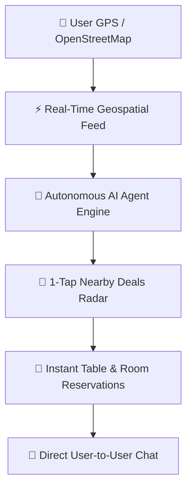

# 🍽️ GoDine v2.0 — Geospatial Hospitality Discovery & AI Social Network

[](https://godine.app)
[](https://www.python.org/)
[](https://fastapi.tiangolo.com/)
[](https://reactjs.org/)
[](LICENSE)
[]()

> **GoDine** is the next-generation **geospatial discovery & AI social network** connecting verified **hotels, boutique cafes, resthouses, highway motels, and fine dining spots** with travelers and diners in real-time.

---

## 🌟 Strategic Product Advantages — Why GoDine Wins

Every day, millions of hungry diners and travelers search for great stays and bites — only to get lost in outdated reviews, generic ads, and non-actionable directories. **GoDine solves this.**



| Traditional Directories | **GoDine v2.0 Advantage** |
|:--- |:--- |
| Static list of businesses | **Live Social Feed** with real-time merchant promo posts & photos |
| City-level broad search | **GPS Pinpoint Radius** (200m – 15km) powered by OpenStreetMap & Geoapify |
| Single star rating | **Aspect-Based AI Sentiment** (*Taste: 4.9*, *Ambience: 4.8*, *Service: 4.7*) |
| Manual browsing | **Autonomous AI Agent** — executes bookings, map filters, and posts on request |
| No deal scanning | **1-Tap Nearby Deals Radar** — scans % OFF promos & flash deals near GPS coordinates |
| Complex booking forms | **Instant Table & Room Reservations** in 2 taps |
| Isolated user accounts | **Direct User-to-User Messaging** between User IDs, handles, & merchant partners |

---

## 🔥 Key Technical & Product Features

### 🤖 1. Autonomous AI Agent Engine (Floating Widget)
- **Floating AI Assistant** (`FloatingAiWidget.jsx`) available across **every page of the application**.
- **Action Execution**: The AI Agent parses natural language commands and executes live UI actions:
  - **`"Book a table at Copper Kettle Bistro"`** ➔ Opens instant Reservation Manager modal prefilled.
  - **`"Create post about delicious ramen"`** ➔ Opens Post Creator modal.
  - **`"Search hotels near me"`** ➔ Switches to interactive **Explore Map** view.
  - **`"Info on Aura Boutique Hotel"`** ➔ Opens full Venue Profile page with aspect sentiment scores.

### 📡 2. 1-Tap Nearby Deals & Offer Radar
- Tapping **"Deals Radar"** triggers an instant scan of nearby GPS coordinates, OpenStreetMap Overpass API, and backend databases.
- Displays live active discount cards (**20% OFF TODAY**, **15% OFF SPECIAL**) with 1-tap table/room reservation.

### 🔐 3. Google OAuth 2.0 & Bearer JWT Authentication
- **Google OAuth 2.0 Integration**: Native Google Identity Services (GSI) ID-token verification (`POST /api/v1/auth/google`) with automatic HTTPS `tokeninfo` fallback.
- **Bearer JWT Session Security**: Encrypted token storage (`godine_token`) attached automatically to headers for authenticated endpoints.

### 💬 4. Direct User-to-User Messaging
- Direct chat system between user IDs, handles (`@alex_rivera`, `@daniel_vance`), and merchant partner venues.
- Includes **`+ New Chat`** modal to open direct channels with any User ID or email.

### 🗺️ 5. GPS-Driven OpenStreetMap & Leaflet Exploration
- Live Leaflet map rendering customized color-coded pins for **Restaurants 🍽️, Hotels 🏨, Motels 🚗, Resthouses 🏡, Cafes ☕, and Bakeries 🥐**.
- Geoapify integration for automatic address-to-GPS coordinate conversions.

---

## 🛠️ Technology Architecture

```
e:\Holetmo
├── frontend/
│   ├── src/
│   │   ├── components/
│   │   │   ├── auth/          # AuthPage.jsx (Google OAuth 2.0 + JWT Login)
│   │   │   ├── common/        # FloatingAiWidget.jsx (Autonomous AI Agent & Deals Radar)
│   │   │   ├── landing/       # LandingPage.jsx (Hero showcase, AI Concierge, Testimonials)
│   │   │   ├── feed/          # HomeFeed.jsx, PostCard.jsx, RightSidebar.jsx
│   │   │   ├── explore/       # ExploreMap.jsx (Leaflet + OpenStreetMap Overpass QL)
│   │   │   ├── messages/      # MessagesPage.jsx (Direct User ID Chat & AI Concierge)
│   │   │   ├── profile/       # UserProfile.jsx (Profile Header & Loyalty Rewards)
│   │   │   ├── reservation/   # ReservationModal.jsx
│   │   │   └── venue/         # VenueProfile.jsx
│   │   ├── services/          # api.js (Axios/Fetch wrapper with JWT Bearer header)
│   │   └── store/             # store.js (Zustand state store & AI Action Engine)
│   ├── index.html
│   ├── index.css              # Tailwind CSS v4 + Leaflet maps + Glassmorphism
│   └── vite.config.js
└── backend/
    ├── app/
    │   ├── api/v1/endpoints/  # auth.py, posts.py, venues.py, reservations.py, osm.py, chat.py
    │   ├── core/              # config.py, database.py, security.py
    │   ├── models/            # SQLAlchemy models (User, Venue, Post, Review, Reservation)
    │   └── services/          # sentiment_service.py, geo_service.py, osm_service.py
    ├── tests/                 # test_backend.py (Pytest suite)
    └── requirements.txt
```

---

## 🚀 Quick Start Guide

### 1. Run Backend Server (FastAPI)
```bash
cd backend
python -m venv venv
.\venv\Scripts\activate
pip install -r requirements.txt

# Run Uvicorn dev server with hot reload
python -m uvicorn app.main:app --reload --host 0.0.0.0 --port 8000
```
- API Gateway & Swagger Docs: `http://localhost:8000/docs`

### 2. Run Frontend Web Application (React + Vite)
```bash
cd frontend
npm install
npm run dev
# Open browser at http://localhost:5173
```

---

## 🧪 Automated Testing & Build Verification

Run backend unit tests & API verification:
```bash
cd backend
.\venv\Scripts\python -m pytest tests
# Results: 5 passed in 2.74s
```

Run frontend production bundle build:
```bash
cd frontend
npm run build
# Results: 1882 modules transformed, built in 402ms
```

---

## 🔒 Security & Environment Setup

**`backend/.env`**
```env
PROJECT_NAME="GoDine"
API_V1_STR="/api/v1"
SECRET_KEY="your-secret-key-here"
GOOGLE_CLIENT_ID="YOUR_GOOGLE_CLIENT_ID.apps.googleusercontent.com"
GOOGLE_CLIENT_SECRET="YOUR_GOOGLE_CLIENT_SECRET"
GEOAPIFY_API_KEY="YOUR_GEOAPIFY_API_KEY"
```

**`frontend/.env`**
```env
VITE_GOOGLE_CLIENT_ID="YOUR_GOOGLE_CLIENT_ID.apps.googleusercontent.com"
VITE_GEOAPIFY_API_KEY="YOUR_GEOAPIFY_API_KEY"
```

---

## 📋 Core API Endpoints Summary

| Method | Endpoint | Description | Access |
|:--- |:--- |:--- |:--- |
| `POST` | `/api/v1/auth/register` | Register new user account | Public |
| `POST` | `/api/v1/auth/login` | Authenticate email/password & return JWT | Public |
| `POST` | `/api/v1/auth/google` | Verify Google GSI ID Token & return JWT | Public |
| `GET` | `/api/v1/auth/me` | Fetch active user profile | Bearer |
| `GET` | `/api/v1/venues/` | Fetch nearby venues by GPS | Public |
| `POST` | `/api/v1/posts/` | Create GPS-tagged post/promo | Bearer |
| `POST` | `/api/v1/reservations/` | Create table or room reservation | Bearer |
| `POST` | `/api/v1/reviews/` | Submit aspect-based sentiment review | Bearer |
| `POST` | `/api/v1/chat/` | Autonomous AI Agent query endpoint | Bearer |

---

## 📄 License

Distributed under the **MIT License**. See `LICENSE` for details.

*Built with passion for food explorers, travelers, and hospitality entrepreneurs worldwide.*
